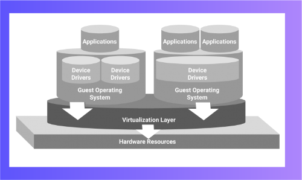

## Module 5: VMware and Virtualization

Module 5 covers virtualization and virtual machines, focusing on VMware. You will learn how VMware allows you to create a "computer within a computer" and explore its real-world applications, installation, and advantages.

### What You Will Learn:
- Understand virtualization and virtual machines
- Learn uses and benefits of VMware
- Gain practical knowledge on installing and using VMware

---

## Key Terms and Concepts

- **Guest Operating System (GOS)**  
  The OS running inside the virtual machine, which believes it controls the hardware but is managed by the virtual machine.

- **Host Operating System**  
  The OS that runs on the physical machine and hosts the virtual machines, isolating them from itself.

- **Host Hardware**  
  The physical computer hardware on which the host OS and virtual machines run.

- **Virtualization**  
  Creating virtual versions of devices or resources that allow multiple isolated environments on one physical machine.

- **Virtual Machine (VM)**  
  An application that simulates a full computer system within another computer, providing the user experience of a real machine.

## Virtualization

Virtualization is the creation of a virtual version of a device or resource on a computer. For example, partitioning a single hard drive into multiple virtual drives lets each act as an independent hard drive. This virtual framework lets users work as if they are using a real, unified device.

### Types of Virtualization:

- **Storage Virtualization:** Combines physical storage into a single storage pool accessible by the host OS.
- **Network Virtualization:** Splits network bandwidth into separate channels, each acting as an independent network.
- **Server Virtualization:** Divides a physical server into multiple virtual servers, each running its own OS.
- **Hardware Virtualization:** Enhances processor performance by improving instruction and memory management (used by Intel, AMD).
- **Application Virtualization:** Dynamically allocates computing resources and can work layered on other virtualization types.

### Learn more:  
*“What is Virtualization?”* — NDG and VMware introductory course for beginners.

## VMware Workstation, Its Uses, and Advantages

VMware is virtualization software developed by VMware Inc., a subsidiary of Dell Technologies. It enables running multiple operating systems as virtual machines (VMs) on a single PC, including Linux and Windows.

### Uses of VMware
- Testing or piloting new operating system versions  
- Virtualization from your own desktop  
- Running different or outdated operating systems alongside the host OS  
- Running software designed for other operating systems  
- Testing applications on multiple platforms  
- Safely using potentially risky storage devices (e.g., USB drives) inside a guest OS  
- Consolidating multiple servers for business purposes  

### Advantages of VMware
- Allows simultaneous use of multiple operating systems, isolated from each other  
- Supports instruction set architectures different from physical computers  
- Simplifies maintenance, application provisioning, availability, and recovery  
