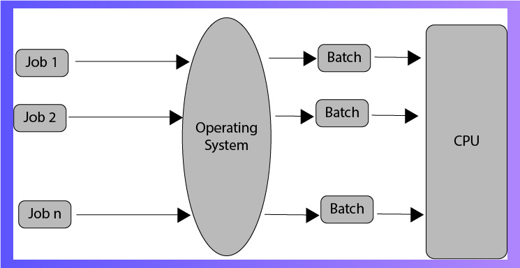
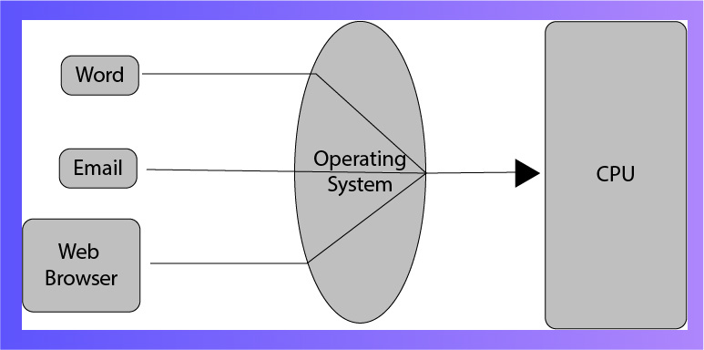
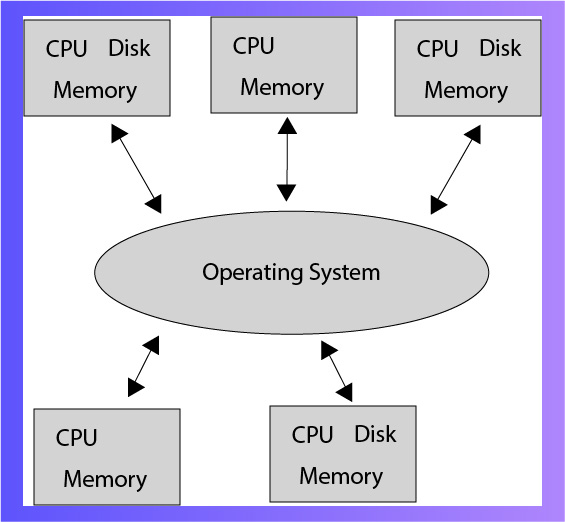
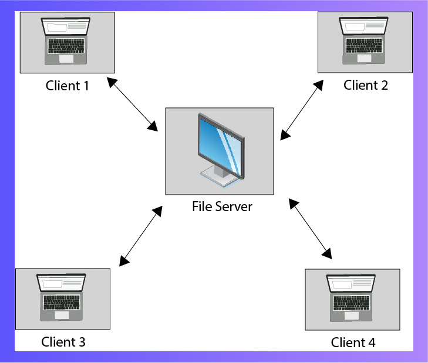
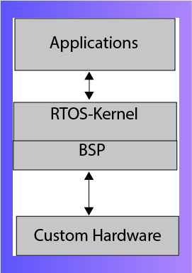

## Module 11: Operating Systems 

## Overview

This module introduces different types of operating systems, their architecture, and their uses. It covers the command line and batch files, explaining why and how they are used.

You will explore:

- Types of operating systems and how to choose them based on requirements  
- Basic OS architecture, advantages, and disadvantages  
- The command line: its importance, basic commands, and two display modes  
- Batch files: basic commands and how to create them, including a video tutorial  

---

### Learning Outcomes

By the end of this module, you should be able to:

- Write batch file scripts to create/modify environment variables, execute programs, and check command completion status  
- Explain types and purposes of different OS layers  
- Understand and use command lines  

---

### Key Terms and Concepts

- **Operating Systems:**  
  The interface between the user and the computer, managing hardware and resources.

- **Command Line:**  
  An interface space where users type commands for execution by the machine.

- **Batch File:**  
  Small text files containing a series of commands, easy to use for automating tasks on home computers.

## Types of Operating Systems

Operating systems manage resources, provide an interface between users and machines, and control hardware and data. Different types serve various needs:

### Batch Operating System
- Groups similar jobs into batches for efficient processing.
- Pros: Effective for managing large similar jobs; good processor utilization; supports multiple users sharing the batch system.
- Cons: Debugging is complex; job failures cause unpredictable behavior.
- Examples: Bank statements processing, payroll systems.

### Time-Sharing Operating System
- Allocates specific time slots to each task, cycling through tasks to ensure fairness.
- Pros: Equal opportunity for all tasks.
- Cons: Data communication can sometimes be problematic.
- Example: Unix.

### Distributed Operating System
- Consists of loosely coupled autonomous systems working together.
- Pros: Users can access data not physically on their machine; fast and durable computation.
- Cons: Failure of main network can halt the entire system.
- Example: LOCUS.

### Network Operating System
- Runs on a server managing shared resources across tightly coupled systems.
- Pros: Centralized, stable, with shared resource management.
- Cons: Can be costly.
- Examples: Microsoft Windows Server, Linux.

### Real-Time Operating System
- Designed for applications with strict time constraints and response sensitivity.
- Pros: Optimal memory management and quick processing.
- Used in: Missile systems, traffic control systems.

## Command Line

The command line (also called Command Prompt or Shell) is a text-based interface where users type commands to interact with the computer. It operates in a console (text-only) or terminal window (within a GUI). Commands are interpreted and executed by the shell.

**Common commands:**  
- `CD` — change directories  
- `DIR` — list folder contents  
- `MD` — create a new folder

While powerful, the command line is less popular than GUIs due to its steeper learning curve.  
To open the command prompt, type `CMD` in the Run dialog and press Enter.

## Batch Files

Batch files are text files containing a sequence of commands executed by the shell. They have extensions `.bat` or `.cmd`.

### Basic Batch File Commands

- **ECHO**  
  Prints text to the scrSeen.

- **PAUSE**  
  Displays "Press any key to continue…" and pauses execution until a key is pressed.

- **CLS**  
  Clears the command prompt window.

- **SET**  
  Sets a variable. Use `ECHO` to display the variable’s content.
