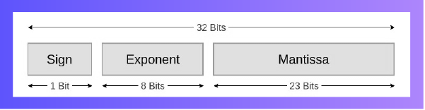
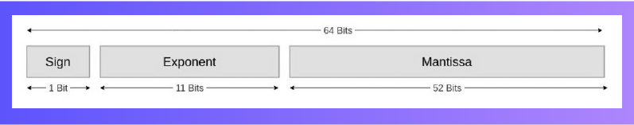

# Module 7: Binary Operations and IEEE-754 Standard

## Overview

This module covers how binary numbers are stored as unsigned and signed values in computer memory, including the concepts of most- and least-significant bits and computer word size. It explains binary addition and subtraction with examples and video tutorials. The module also introduces the IEEE 754 standard for floating-point representation and teaches how to convert decimal numbers to IEEE 754 single-precision format with a step-by-step video guide.

### Learning Outcomes

By the end of this module, you will be able to:

- Explain how signed and unsigned binary numbers are stored  
- Understand carry, borrow, and overflow in CPU arithmetic  
- Perform binary addition and subtraction  
- Convert between decimal and IEEE 754 floating-point numbers  

### Key Terms

- **IEEE-754 Standard**: A widely accepted technical standard for floating-point arithmetic by IEEE.  
- **Unsigned Numbers**: Always positive, no sign needed.  
- **Signed Numbers**: Can be positive or negative, requiring a sign.  

## Signed and Unsigned Numbers

A **signed binary number** can be positive or negative, while an **unsigned binary number** is always positive and does not require a sign bit.

### Storage Differences

- **8-bit signed binary**: Uses 1 bit for the sign (0 = positive, 1 = negative), allowing values from **-128 to +127**.
- **8-bit unsigned binary**: All 8 bits are used for value representation, allowing values from **0 to 255**.

#### Example:
- Signed: `10000000` = -128, `01111111` = +127  
- Unsigned: `11111111` = 255, `00000000` = 0

> **Additional Reading**: [Unsigned and Signed Binary Numbers](#)

---

## Carry Flag and Overflow Flag

- **Carry flag**: Used in **unsigned binary** calculations when result exceeds maximum value (255 in 8-bit).
- **Overflow flag**: Used in **signed binary** when result exceeds signed range or causes a sign bit error.

#### Examples: Carry Flag

**22 + 47 (8-bit unsigned)**  
    00010110 (22)  
  + 00101111 (47)  
  -----------
    01000101 (69)

69 is within 0–255 → **Carry flag = 0**

**101 + 176 (8-bit unsigned)**  
    01100101 (101)  
  + 10110000 (176)  
  -----------
 1 00010101 (277)

277 exceeds 255 → **Carry flag = 1**

---

#### Examples: Overflow Flag

**46 + 37 (8-bit signed)**  
    00101110 (46)  
  + 00100101 (37)  
  -----------
    01010011 (83)

Result is within -128 to 127 → **Overflow flag = 0**

**52 + 78 (8-bit signed)**  
    00110100 (52)  
  + 01001110 (78)  
  -----------
    10000010 (−126 interpreted if sign bit used)

Leftmost bit changes from 0 to 1 (positive → negative) → **Overflow flag = 1**

---

## Two's Complement

Two's complement is a method of representing **negative binary numbers** to simplify arithmetic.

### Method 1: Flip after first 1 from the right
Example: Represent **−7** using 5 bits  
- +7 = `00111`  
- Two's complement: → `11001`  
  (leave all bits after first 1 unchanged, flip the rest)

### Method 2: Invert bits and add 1
Example: Represent **−7**  
- +7 = `00111`  
- Invert = `11000`  
- Add 1 = `11001`

So, **−7 in 5-bit two’s complement = `11001`**

## Addition of Signed Binary Numbers

There are two types of operations in the addition of binary numbers:

- **Addition of binary numbers with different signs**  
- **Addition of binary numbers with the same sign**

#### Example: Subclass 1 — Addition with Different Signs  
**(−20) + (+30)**  

    1 1 1 0 1 1 0 0   (this is the two's complement of −20)  
  + 0 0 0 1 1 1 1 0  
    0 0 0 0 1 0 1 0  

#### Example: Subclass 2 — Addition with Same Sign  
**(80) + (90)**  

    0 1 0 1 0 0 0 0  
  + 0 1 0 1 1 0 1 0  
    1 0 1 0 1 0 1 0  

---

## The Computer Word

A **computer word** is the standard unit of data a CPU can process at once. Historically, it was **32 bits**, but modern systems mostly use **64-bit** words.

#### Example: Representing `11011001` as a 32-bit computer word

    0000 0000 0000 0000 0000 0000 1101 1001

- The **leftmost bit** (0) is the **most significant bit (MSB)**.  
- The **rightmost bit** (1) is the **least significant bit (LSB)**.

A **32-bit computer word** can represent values from:

    0 to 2³² − 1 = 4,294,967,295

## Binary Addition

In binary, the addition is similar to the addition operation in decimal with a few rules to keep in mind. Since we are only dealing with two possible digits in binary numbers (0 and 1), the rules are easy to follow. The addition of binary has three possibilities:

- `0 + 0 = 0`
- `0 + 1` or `1 + 0 = 1`
- `1 + 1 = 0` with a **carry** of `1`

---

### Example 1

    1 0 1 1 0 1  
  +   1 1 0 0 1  
  ------------
    1 0 0 0 1 1 0

---

### Example 2

    1 0 1 1 0 0 1  
  +   1 1 1 0 1 0  
  ----------------
    1 0 0 1 0 0 1 1

## Binary Subtraction

In binary, subtraction is similar to decimal subtraction, with a few specific rules due to the limited set of digits (`0` and `1`). The rules are:

- `0 - 0 = 0`
- `1 - 0 = 1`
- `1 - 1 = 0`
- `0 - 1 = 1` (requires borrowing, where `0` becomes `10` by borrowing `1` from the next higher bit)

---

Refer to the following video for a step-by-step guide to subtracting binary numbers:

---

#### Example 1

    1 0 0 0 1 0 1  
  -   1 0 1 1 0 0  
  ----------------
    0 0 1 1 0 0 1

---

#### Example 2

    1 1 1 0 1 1 0  
  - 1 0 1 0 1 1 1  
  ----------------
    0 0 1 1 1 1 1

## IEEE 754 Standard

Representing a real number in machines can be challenging. The IEEE 754 standard is a widely used and efficient method for floating-point representation. It breaks a number into three parts:

### Components

- **Sign Bit**  
  - `0` for positive numbers  
  - `1` for negative numbers

- **Exponent**  
  - Represents the exponent in scientific notation  
  - A **bias** is added to allow both positive and negative exponents  
    - Bias is `127` for single precision  
    - Bias is `1023` for double precision

- **Mantissa (Significand)**  
  - Contains the fractional part of the number  
  - Does not include the leading 1 (it's implicit)

---

### IEEE 754 Formats

#### Single Precision (32 bits)

- **Sign**: 1 bit  
- **Exponent**: 8 bits  
- **Mantissa**: 23 bits  

#### Double Precision (64 bits)

- **Sign**: 1 bit  
- **Exponent**: 11 bits  
- **Mantissa**: 52 bits  

---

### Example: Convert -176.375 to IEEE 754 Single Precision

#### Step 1: Determine Sign  
- Since the number is negative, the sign bit = `1`

#### Step 2: Convert Decimal to Binary  
Break into two parts:  
- **Integer part (176)** → `10110000`  
- **Fractional part (0.375)**:  
  - 0.375 × 2 = 0.75 → `0`  
  - 0.75 × 2 = 1.5 → `1`  
  - 0.5 × 2 = 1.0 → `1`  
  - So, 0.375 = `.011`  
  - Full binary: `10110000.011`

#### Step 3: Normalize  
- Move decimal point after first 1 → `1.0110000011 × 2^7`

#### Step 4: Calculate Exponent  
- Bias for single precision = `127`  
- Actual exponent = `7`  
- Stored exponent = `127 + 7 = 134` → Binary: `10000110`

#### Step 5: Extract Mantissa  
- Drop the leading 1 → Mantissa: `01100000110000000000000` (23 bits)

#### Final IEEE 754 (Single Precision)  
- **Sign**: `1`  
- **Exponent**: `10000110`  
- **Mantissa**: `01100000110000000000000`

#### Final 32-bit Binary Representation  
1 10000110 01100000110000000000000
