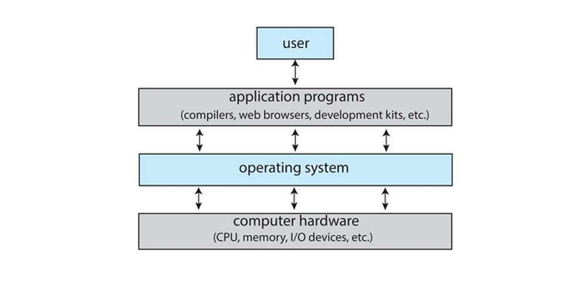
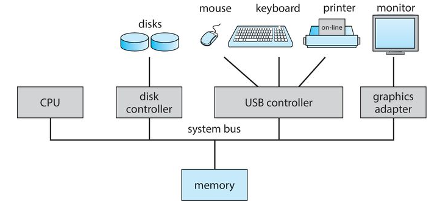
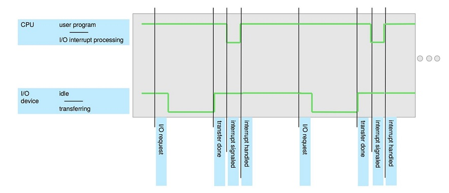
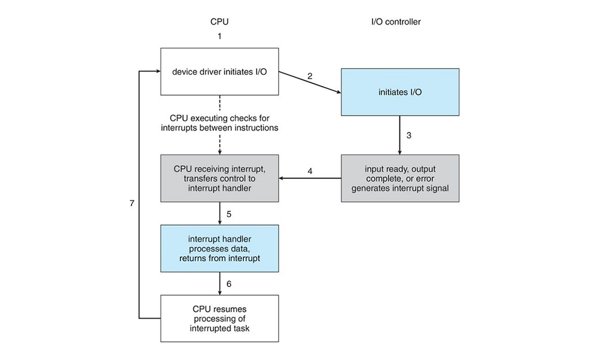
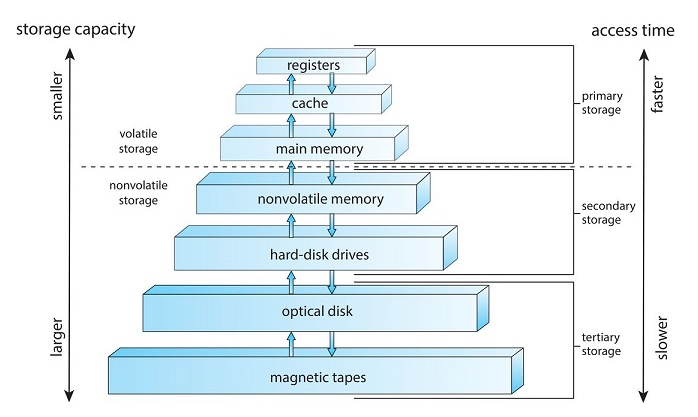
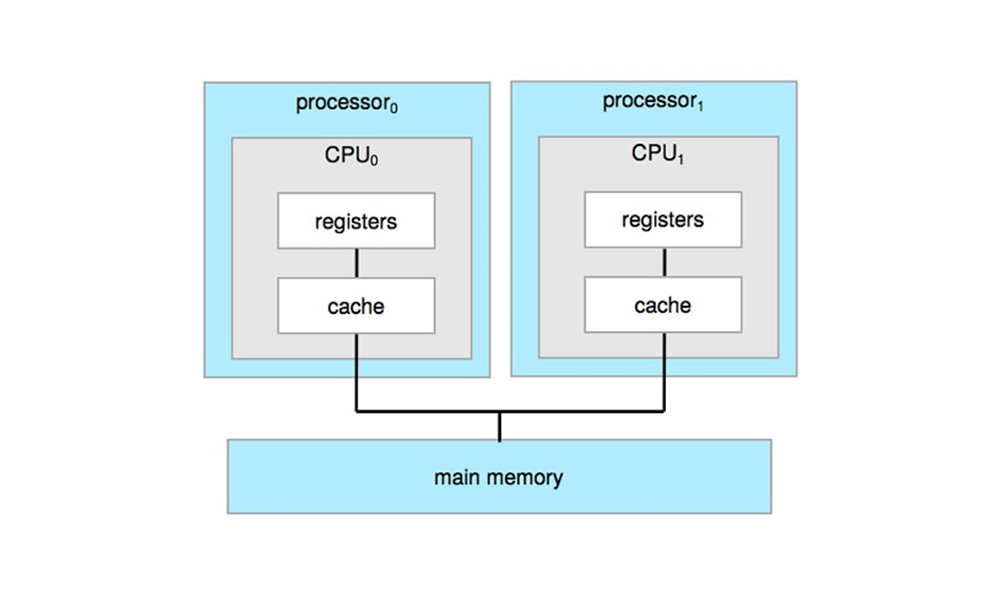
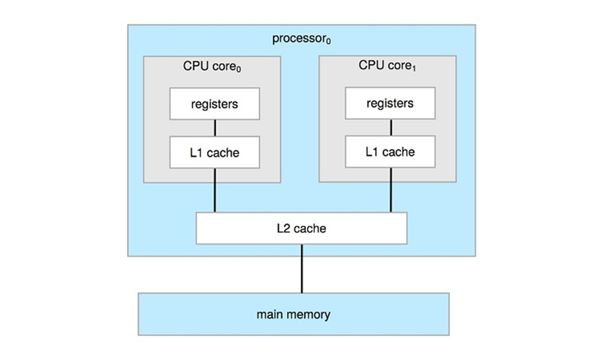
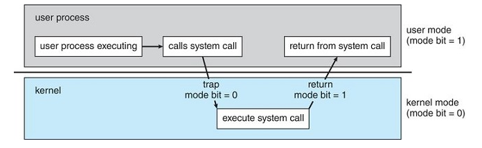
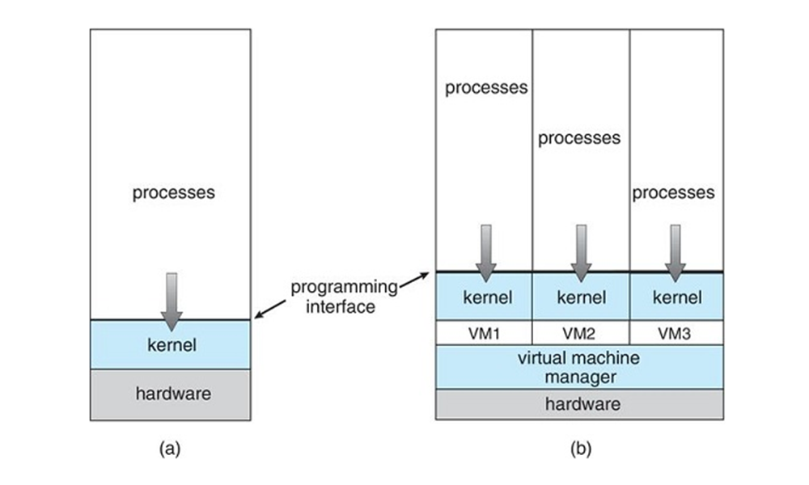

# Module 1: Operating Systems – Basic Concepts and Components

## Introduction  
This module provides an overview of operating system (OS) architectures, concepts, and core software components. It covers key topics like process, memory, and storage management, showing how these are implemented in everyday OSs. You will also install a popular Linux distribution and start using the command shell to explore and customize the system.

### Learning Outcomes  
By the end of this module, you will be able to:
- Identify and explain fundamental OS concepts and components.
- Compare OS concepts across different systems and hardware.
- Explain what Linux is and name several Linux distributions.
- Describe virtualization techniques and use a virtual machine to run an OS.
- Use the Ubuntu Linux desktop graphical interface.
- Use the Linux shell to run common system commands.

### Key Terms and Concepts  
- **Operating System**: Software managing hardware, providing a platform for applications, and acting as an intermediary between users, applications, and hardware.  
- **Kernel**: Core OS component running continuously after boot.  
- **Kernel-mode vs. User-mode**: Kernel mode allows full system call execution; user mode restricts processes to non-system calls.  
- **Process Scheduler**: Selects processes for CPU execution.  
- **File System**: Manages data storage and retrieval efficiently.  
- **Shell**: Command-line interpreter in an OS.  
- **Linux Distribution**: A Linux system with administrative tools for easier installation and management.  
- **Virtualization**: Abstracting hardware to create multiple isolated execution environments on one physical machine.

## What Operating Systems Do

Computer systems consist of four main components:  
- **Hardware**  
- **Operating System**  
- **Applications**  
- **Users**

The operating system (OS) acts as an intermediary between users, applications, and hardware.

Operating systems are found in a wide variety of devices beyond just desktop computers — including tablets, mobile phones, elevators, electricity meters, televisions, automobiles, and even refrigerators.

User interaction with these systems can range from highly interactive graphical interfaces to minimal or no direct user interaction (e.g., a simple on/off switch), and can include voice-driven interfaces like Siri or Alexa.

Since the OS faces many possibly conflicting requests for resources, it must allocate them efficiently and fairly among programs and users. This involves control programs and resource allocators that manage hardware elegantly.

The **kernel** is the core OS component loaded during system boot, acting as the manager and authority over hardware and devices.

## Computer-System Organization

A modern general-purpose computer system typically consists of:  
- One or more CPUs  
- Multiple device controllers  
- A common bus that connects components and shared memory  

Each hardware device usually requires a vendor-specific device driver, which must be loaded and recognized by the OS kernel. Without a compatible driver, the OS cannot use the device.

The OS manages resource requests from multiple processes safely and efficiently using an **interrupt model**:  
- When a program requests a resource, its process is blocked until the resource is available.  
- The hardware device signals the CPU via an interrupt instruction, which unblocks the process to continue.

Interrupt Driven I/O cycle example:

Computers use both volatile and non-volatile memory:  
- Memory closer to the CPU is faster to access.  
- If main memory is insufficient, the OS uses secondary storage (e.g., hard drives, microSD, optical drives) for non-volatile memory access.

## Computer-System Architecture

Multiprocessor systems are now common in modern computing.

- **Symmetric Multiprocessing (SMP):**  
  Each CPU (peer processor) performs all tasks, including OS functions and user processes.

- **Multicore Systems:**  
  Systems with one or more CPUs, each containing multiple computing cores on a single chip.  
  Multicore systems can be more efficient than multiple single-core chips because communication within a chip is faster than communication between chips.

## Operating-System Operations

- **Kernel Services:**  
  After boot, the kernel provides core services through system daemons (Windows calls these Windows services).

- **Multiprogramming:**  
  Allows multiple programs (processes) to be loaded in memory simultaneously. When one process waits (e.g., for I/O), the OS switches to another to keep the CPU busy.

- **Multitasking:**  
  An extension of multiprogramming where the CPU switches rapidly among processes, making it appear they run concurrently (e.g., writing email, listening to music, backing up data all at once).

- **Process Scheduler:**  
  Balances process throughput and response time, preventing deadlocks where processes wait indefinitely.

- **Dual-mode Operation:**  
  - **Kernel Mode:** Privileged mode where the OS runs with full hardware access.  
  - **User Mode:** Restricted mode where user processes run without direct hardware access to protect system stability.

- **Pre-emptive Multitasking:**  
  Uses a timer to regularly interrupt processes, preventing any single process from monopolizing the CPU or freezing the system.

# Virtualization

- Virtualization abstracts the hardware of a single computer (CPU, memory, storage, network, etc.) into multiple separate execution environments.
- Each environment appears as if it is running on its own private computer, allowing different operating systems (e.g., Windows and UNIX) to run simultaneously.
- A **virtual machine manager** (also called a **hypervisor**) manages these virtual machines on a single host system.

## Process Management

- A **process** is a program in execution, loaded into main memory and run by the CPU.
- Processes require resources such as CPU time, memory, I/O devices, and files. The operating system manages access to these resources.
- When a process terminates, it must release all allocated resources back to the system.
- **Single-threaded processes** have one program counter and may block while waiting for resources.
- **Multi-threaded processes** have multiple program counters, each for a separate thread of execution.
  
### Operating System Responsibilities for Process Management:
- Creating and deleting user and system processes
- Scheduling processes and threads on CPUs
- Suspending and resuming processes
- Providing process synchronization mechanisms
- Facilitating process communication mechanisms

## Memory Management

- **Main memory** is the primary storage directly accessible by the CPU.
- Data from secondary storage must be loaded into main memory before the CPU can access it.

### Operating System Responsibilities for Memory Management:
- Tracking which memory parts are in use and by which processes
- Allocating and deallocating memory space as needed
- Deciding which processes or data to load into or remove from memory
- Protecting processes from accessing memory allocated to other processes

## Storage Management

Operating systems provide a uniform, logical view of information storage across diverse secondary and tertiary storage devices (e.g., optical drives, tape, USB sticks), abstracting hardware differences from users and programmers.

### File Management Responsibilities:
- Creating and deleting files
- Creating and deleting directories for file organization
- Supporting file and directory manipulation primitives
- Mapping files to mass storage devices
- Backing up files on stable, non-volatile storage media

### Secondary Storage Management Responsibilities:
- Mounting and unmounting storage devices
- Managing free space
- Allocating storage
- Scheduling disk operations
- Partitioning storage devices
- Protecting storage and files

## What is Linux?

Linux is a Unix-like operating system known for being free software and open source, allowing anyone to freely modify, use, and redistribute its source code.

- **Creator:** Linus Torvalds, a University of Helsinki student, developed Linux in the early 1990s as a hobby. He aimed to create a simple UNIX-type OS that was PC (386/486 clones) compatible and free.
- **Development:** Linus Torvalds continues to lead the kernel development. Other components like GNU are developed separately and combined in Linux distributions.
- **Linux Distributions:** Variants of Linux that package the kernel with software suited to different needs, ranging from full desktop/server systems to minimal environments.

### Differences Between Linux Distributions:
- Kernel optimizations
- Default installed packages
- Installation routine interfaces
- Administration tools for installation, configuration, and removal of software

### Advantages of Linux:
- Multi-user, multi-process/multitasking, and multi-processor capable
- No licensing requirements or subscription fees
- Large community and support groups
- Supports major peripherals
- Can coexist with other operating systems
- Access to many file systems
- Runs on very small embedded computers

### Additional Resources:
- [Linux Wikipedia](https://en.wikipedia.org/wiki/Linux)
- [Comparison of Linux distributions](https://en.wikipedia.org/wiki/Comparison_of_Linux_distributions)

## Basic Linux Commands (Part 1)

### Linux Command Line
- While GUIs are convenient, many admins prefer command line utilities for their power, speed, and completeness.
- Command line utilities run in text-based terminals.

---

### Common Basic Commands

| Command      | Description                               | Example                          |
|--------------|-------------------------------------------|---------------------------------|
| `passwd`     | Change user password                       | `passwd`                        |
| `whoami`     | Show the current user                      | `whoami`                       |
| `hostname`   | Show system hostname                       | `hostname`                     |
| `uname`      | Show operating system name                 | `uname`                        |
| `uptime`     | Show system uptime and load average       | `uptime`                      |
| `ls`         | List directory contents                    | `ls -la` (detailed + hidden files) |
| `cd`         | Change directory                           | `cd /root` or `cd` (home directory) |
| `pwd`        | Show current working directory             | `pwd`                          |
| `mkdir`      | Create directory                           | `mkdir test` or `mkdir -p parent/child` |
| `rmdir`      | Remove empty directory                      | `rmdir parent/child` or `rmdir -p parent/child` |
| `more`       | View text one screen at a time             | `ls -al /etc | more`            |
| `less`       | Like `more` but more flexible               | `ls -al /etc | less`            |
| `man`        | Show manual pages for commands              | `man ls`, `man -a command`     |
| `info`       | Read info documents (more detailed than man) | `info ls`                    |

---

### Paths in Linux

#### Absolute Path (Full Path)
- Always starts with `/` (the root directory).
- Example: `/home/user1/test`
- Works from anywhere regardless of current directory.
- `~` (tilde) refers to the current user's home directory.
  
#### Relative Path
- Path relative to the current working directory.
- Use `pwd` to see current directory.
- Special operators:
  - `.` — current directory
  - `..` — parent directory

#### Examples:
Assuming current directory is `/home/user1`:

| Command                | Path Type        | Directory Created     |
|------------------------|------------------|----------------------|
| `mkdir test`           | Relative         | `/home/user1/test`   |
| `mkdir /home/user1/test`| Absolute        | `/home/user1/test`   |
| `mkdir ./test`         | Relative         | `/home/user1/test`   |
| `mkdir ../test`        | Relative         | `/home/test`         |
| `mkdir ../../test`     | Relative         | `/test`              |
| `mkdir /test`          | Absolute         | `/test`              |
