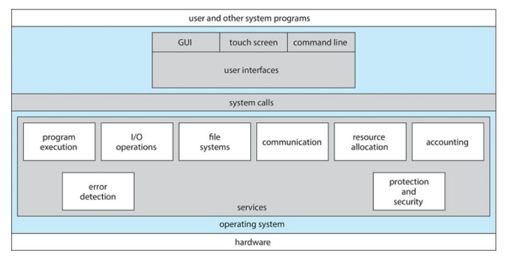
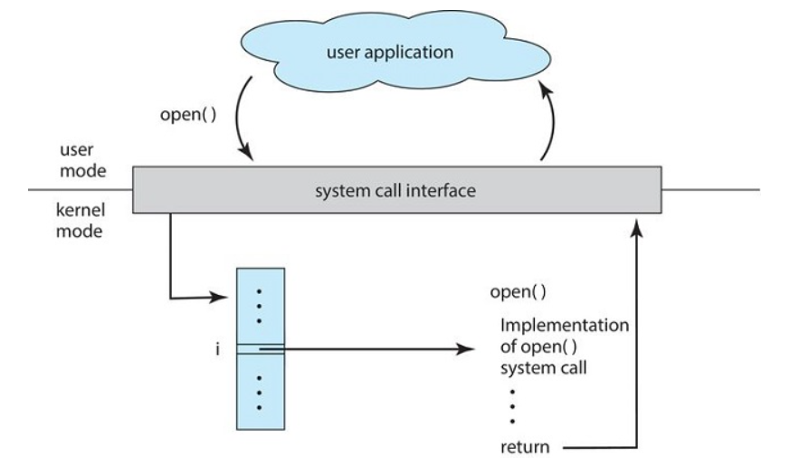
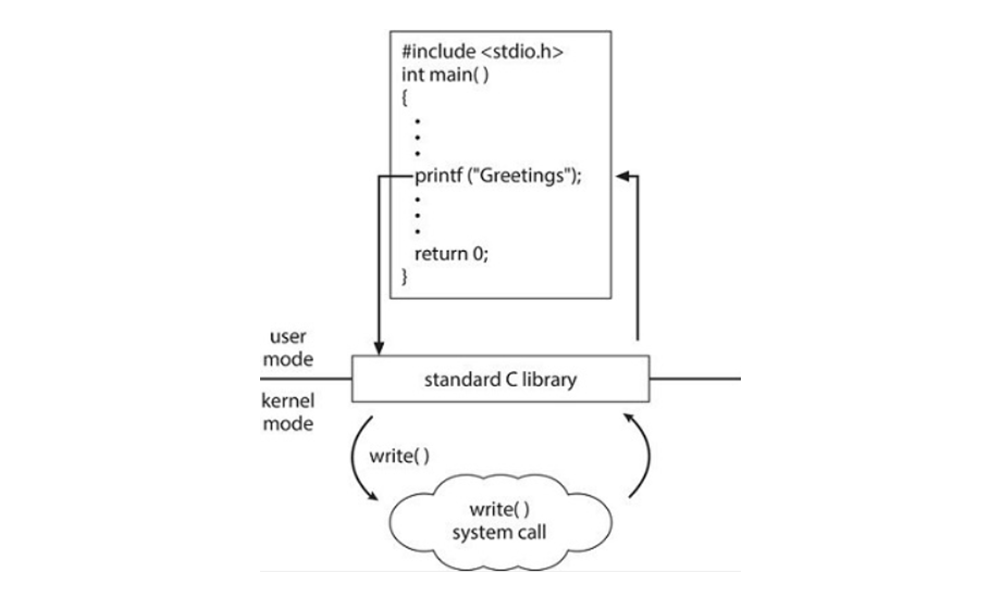
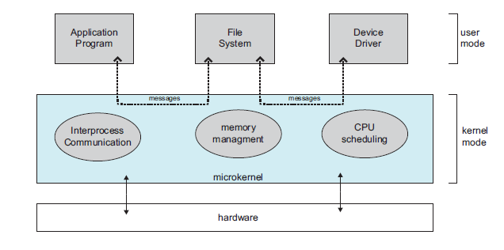

# Module 2: Operating System Structures

## Introduction
This module covers the services provided by an Operating System and illustrates how system calls are used to provide these essential services. We will contrast multiple strategies for designing operating systems and complete the module by getting a better understanding of the system boot sequence. This module will span two weeks.

### Learning Outcomes
By the end of this module, you will be able to:

- Identify services offered by an operating system and how they interrelate.
- Identify the user and operating-system interfaces.
- Identify system call categories and illustrate how system calls are used to provide operating system services through the kernel.
- Identify and describe common operating system services.
- Describe the events that occur when the system is booted up.

### Key Terms and Concepts
Below are a list of terms and concepts that you will come across throughout this module:

**User Interface (UI)**  
A method by which a user interacts with a computer.

**Command-line interface (CLI)**  
A method of giving commands to a computer based on a text input device (such as a keyboard).

**System call**  
Software-triggered interrupt allowing a process to request kernel services.

**Application programming interface (API)**  
A set of functions, structures, and tools that are used by a programmer when developing a program.

**System-call interface**  
An interface that serves as the link to system calls made available by the operating system and it called by processes to invoke system calls.

**Daemon**  
A service that is provided outside of the kernel by system programs that are loaded into memory at boot time and run continuously.

**Bootstrap program**  
The program that allows the computer to start running by initializing hardware and loading the kernel.

## Operating-System Services

An operating system provides an environment for the execution of programs. It makes certain services available to programs and to the users of those programs.

Below is an illustration of common operating system services and how they interrelate.

---

### User interface
Almost all operating systems have a user interface (UI). This interface can take several forms.

- Most commonly, a graphical user interface (GUI) is used. Here, the interface is a window system with a mouse that serves as a pointing device to direct I/O, choose from menus, and make selections, and a keyboard to enter text.
- Mobile systems such as phones and tablets provide a touch-screen interface, enabling users to slide their fingers across the screen or press buttons on the screen to select choices.
- Another option is a command-line interface (CLI), which uses text commands and a method for entering them.
- Some systems provide two or all three of these variations.

### Program execution
The system must be able to load a program into memory and to run that program. The program must be able to end its execution, either normally or abnormally (indicating error). The operating system is also responsible for process scheduling and balancing prioritization.

### I/O operations
A running program may require I/O, which may involve a file or an I/O device. For specific devices, special functions may be desired (such as reading from a network interface or writing to a file system). For efficiency and protection, users usually cannot control I/O devices directly. Therefore, the operating system must provide a means to do I/O.

### File-system manipulation
The file system is of particular interest. Obviously, programs need to read and write files and directories. They also need to create and delete them by name, search for a given file, and list file information. Finally, some operating systems include permissions management to allow or deny access to files or directories based on file ownership. Many operating systems provide a variety of file systems, sometimes to allow personal choice and sometimes to provide specific features or performance characteristics.

### Communications
There are many circumstances in which one process needs to exchange information with another process. Such communication may occur between processes that are executing on the same computer or between processes that are executing on different computer systems tied together by a network.

### Error detection
The operating system needs to be detecting and correcting errors constantly. Errors may occur in the CPU and memory hardware (such as a memory error or a power failure), in I/O devices (such as a parity error on disk, a connection failure on a network, or lack of paper in the printer), and in the user program (such as an arithmetic overflow or an attempt to access an illegal memory location). For each type of error, the operating system should take the appropriate action to ensure correct and consistent computing. Sometimes, it has no choice but to halt the system. At other times, it might terminate an error-causing process or return an error code to a process for the process to detect and possibly correct.

### Other functions exist to help with the overall integrity of the system:

#### Resource allocation
When there are multiple processes running at the same time, resources must be allocated to each of them. The operating system manages many different types of resources. Some (such as CPU cycles, main memory, and file storage) may have special allocation codes, whereas others (such as I/O devices) may have much more general request and release codes. For instance, in determining how best to use the CPU, operating systems have CPU-scheduling routines that take into account the speed of the CPU, the process that must be executed, the number of processing cores on the CPU, and other factors. There may also be routines to allocate printers, USB storage drives, and other peripheral devices.

#### Logging
Record keeping may be used for accounting (so that users can be billed) or simply for accumulating usage statistics. Usage statistics may be a valuable tool for system administrators who wish to reconfigure the system to improve computing services.

#### Protection and security
The owners of information stored in a multiuser or networked computer system may want to control use of that information. When several separate processes execute concurrently, it should not be possible for one process to interfere with the others or with the operating system itself. Protection involves ensuring that all access to system resources is controlled.

Security of the system from outsiders is also important. Such security starts with requiring each user to authenticate himself or herself to the system, usually by means of a password, to gain access to system resources. It extends to defending external I/O devices, including network adapters, from invalid access attempts and recording all such connections for detection of break-ins.

## User and Operating-System Interface

There are several ways for users to interface with operating systems.

---

### Command-Line Interface (CLI)

- A CLI or command interpreter allows direct command entry.
- It may be implemented as part of the kernel or as a separate system program.
- Some operating systems treat the command interpreter as a special program (called a **shell**) that runs when a job is initiated or when a user logs on.

#### Common Shells (UNIX/Linux)

- **Bourne shell (sh)**
- **C shell (csh)**
- **Bourne-Again shell (bash)**
- **Korn shell (ksh)**
- And others

The command interpreter fetches commands from the user and executes them. Commands can also be stored in and executed from a sequential program called a **script**.

---

### Graphical User Interface (GUI)

- Instead of entering commands directly, users interact with a mouse-based window and menu system, characterized by a **desktop metaphor**.
- The desktop contains images (icons) that represent programs, files, directories, and system functions.
- Users move the mouse to select and interact with these elements.

---

### Touch-Screen Interface

- Common in mobile computers where a mouse and keyboard are impractical.
- Users interact with the interface by making gestures on the screen—such as tapping, swiping, or dragging their fingers.

## System Calls

**System calls** are software-triggered interrupts that allow a process to request a service from the kernel. They serve as the primary interface between user processes and the operating system.

---

### Purpose

- Provide access to **kernel-level services**.
- Allow programs to perform operations like I/O, process creation, and memory management.

---

### Invocation

System calls are typically **invoked via a high-level Application Programming Interface (API)**.

- The **API** defines:
  - A set of available functions.
  - The parameters required by each function.
  - The expected return values.

---

### Common APIs

The three most common APIs used in application development are:

- **Win32 API** – for Windows systems.
- **POSIX API** – for POSIX-based systems (including virtually all versions of UNIX, Linux, and macOS).
- **Java API** – for programs running within the Java Virtual Machine (JVM).

---

### Why Use an API Instead of Direct System Calls?

Application programmers typically prefer using an **API** rather than invoking actual system calls directly. Here’s why:

- **Portability**:  
  Programs written to an API can usually compile and run on any system that supports that API, making the software more portable across different operating systems.

- **Abstraction and Simplicity**:  
  APIs abstract away the complex, low-level details of system calls. Actual system calls are often more detailed and harder to work with.

- **Language Support**:  
  Most programming languages include a **run-time support system**—a set of built-in libraries that:
  - Provide a **system call interface**.
  - Intercept API function calls.
  - Invoke the corresponding **system calls** provided by the operating system.

This structure allows developers to focus on higher-level logic without needing deep knowledge of operating system internals.

## Types of System Calls

System calls are categorized based on the services they provide. The six main categories are:

---

### 1. Process Control
- `create process`, `terminate process`
- `load`, `execute`
- `get process attributes`, `set process attributes`
- `wait event`, `signal event`
- `allocate and free memory`

---

### 2. File Management
- `create file`, `delete file`
- `open`, `close`
- `read`, `write`, `reposition`
- `get file attributes`, `set file attributes`

---

### 3. Device Management
- `request device`, `release device`
- `read`, `write`, `reposition`
- `get device attributes`, `set device attributes`
- Logically `attach` or `detach` devices

---

### 4. Information Maintenance
- `get time or date`, `set time or date`
- `get system data`, `set system data`
- `get` or `set` attributes for process, file, or device

---

### 5. Communications
- `create`, `delete` communication connection
- `send`, `receive` messages
- `transfer status information`
- `attach` or `detach` remote devices

---

### 6. Protection
- `get file permissions`
- `set file permissions`

---

## System Call Invocation

> System calls switch the CPU from **user mode** to **kernel mode**.  
> The programmer typically works through **high-level APIs**, without worrying about how the actual tasks (e.g., printing to screen) are implemented.

---

## Communication Models

### Message-Passing Model
- Processes **exchange messages** directly or indirectly (via a **mailbox**).
- Ideal for systems where processes are distributed or require clear synchronization.

### Shared-Memory Model
- Processes **share memory regions** created via system calls.
- Requires processes to **agree** to access shared space.
- Allows **high-speed communication**, as data is exchanged through memory rather than messaging.

---

## System Services

System services (also called **system utilities**) provide a convenient environment for program development and execution. Some are simple user interfaces to system calls; others are complex tools. Categories include:

---

### 1. File Management
- Create, delete, copy, rename, print, list files and directories.
- Access and manipulate files within secondary/tertiary storage systems.

---

### 2. Status Information
- Request date, time, available memory or disk space, user count, etc.
- Provide detailed performance stats, logs, and debugging information.

---

### 3. File Modification
- **Text editors** to create/modify file contents.
- Often include search features and transformation tools (e.g., find & replace).

---

### 4. Programming-Language Support
- **Compilers**, **assemblers**, **debuggers**, and **interpreters** for languages such as:
  - C, C++, Java, Python
- Typically matched to the OS and CPU architecture.

---

### 5. Program Loading and Execution
- Once compiled or assembled, programs must be **loaded into memory** before execution.
- Tools automate and manage this process.

---

### 6. Communications
- Mechanisms for **virtual connections** among:
  - Processes
  - Users
  - Computer systems

---

### 7. Background Services
- Launched at **boot time** or on demand.
- May terminate after completion or persist until shutdown.
- Examples:
  - Disk checking
  - Process scheduling
  - Error logging
  - Printing
- Run in **user context** (not kernel context).

Also known as:  
- **Services** (Windows)  
- **Subsystems**  
- **Daemons** (Unix/Linux)

---

## Application Programs

Operating systems typically come with **application programs** that solve common tasks:

- Web browsers
- Word processors and text formatters
- Spreadsheets
- Database systems
- Compilers
- Plotting and statistical-analysis tools
- Games

These are distinct from system programs, but rely on system services and system calls to function.

## Microkernels

### Background

- As **UNIX** evolved, its **monolithic kernel** became large and difficult to manage.
- In the **mid-1980s**, researchers at **Carnegie Mellon University** developed **Mach**, an OS using the **microkernel approach**.
- The **microkernel architecture** modularizes the operating system by:
  - Removing nonessential components from the kernel.
  - Implementing those components as **system** and **user-level programs**.
- Result: a **smaller, more manageable kernel**.

> ❗ There is no strict consensus on which services should remain in the kernel vs. user space.

**Common microkernel responsibilities:**
- Minimal **process management**
- Minimal **memory management**
- **Inter-process communication (IPC)**

---

### Microkernel Function

- **Main role**: Facilitate **communication** between client programs and system services via **message passing**.
- Example:
  - A client wants to access a file.
  - It sends a **message** to the **file server** via the **microkernel**.
  - The client and file server **never communicate directly**.

---

### Benefits of Microkernel Architecture

1. **Modularity and Extensibility**
   - New services can be added to **user space** without modifying the kernel.
   - Modifications to the kernel are **minimal and localized**.

2. **Portability**
   - A smaller kernel is **easier to adapt** to new hardware architectures.

3. **Security and Reliability**
   - Services run in **user space** instead of kernel space.
   - If a service fails, the **core OS remains stable**.

> ✅ Microkernels are commonly used in systems that prioritize **modularity**, **fault isolation**, and **security**.

## System Boot

The process of starting a computer by loading the kernel is known as **booting** the system.

### Boot Process Overview

1. **Bootstrap Program (Boot Loader)**
   - A small piece of code located in the system's **firmware (e.g., BIOS/UEFI)**.
   - Responsible for **locating** and **loading the kernel** into memory.

2. **Kernel Loading**
   - The **kernel** is loaded into **main memory**.
   - **Execution of the kernel** begins.

3. **Hardware Initialization**
   - The kernel initializes all essential **hardware components** (e.g., memory, I/O devices, CPU settings).

4. **Root File System Mounting**
   - The **root file system** is mounted so that the OS can access files, directories, and services.

5. **System Services Start**
   - System-level programs and **background services** (e.g., daemons) are started.

6. **User Login**
   - A **login prompt** is presented, allowing users to access the system.

---

> 🧠 **Key Concept:** The boot process transitions the system from **firmware execution** to **kernel control**, then finally to **user-level operation**.
