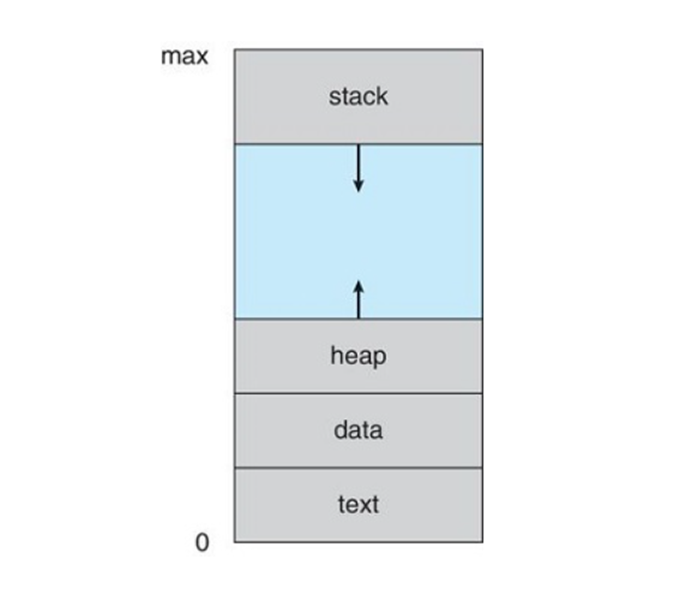
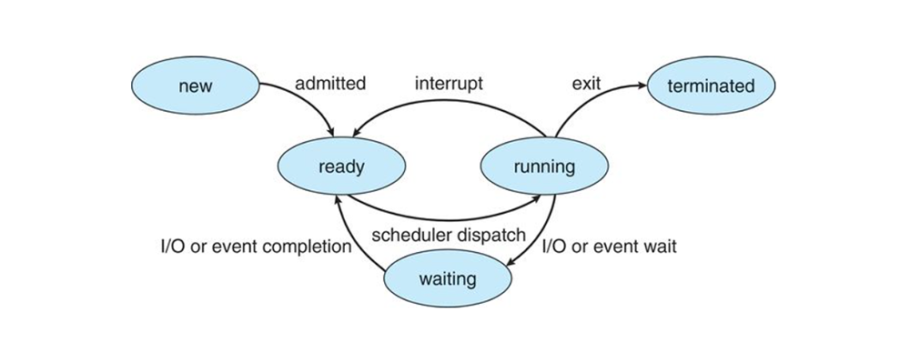
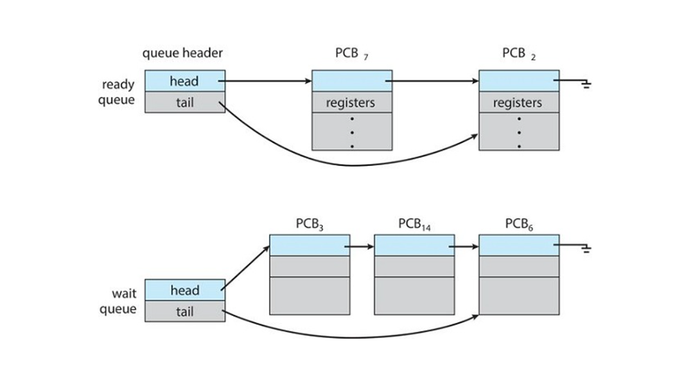
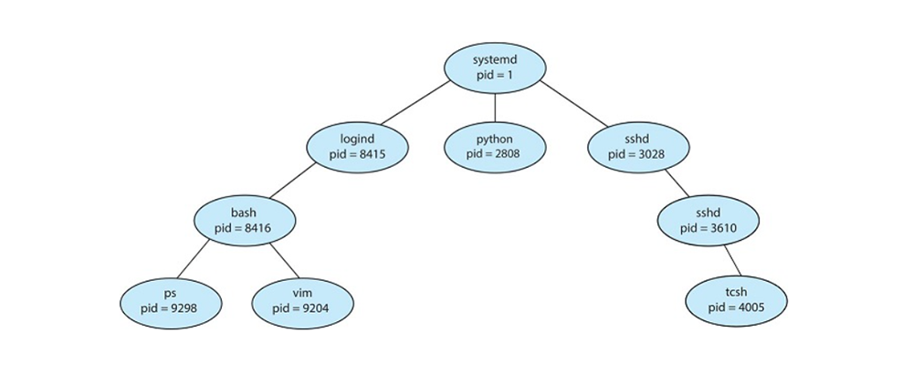
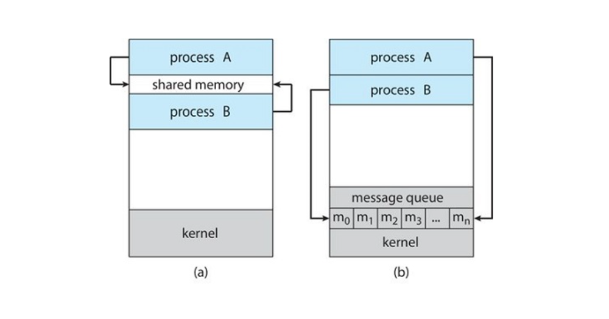
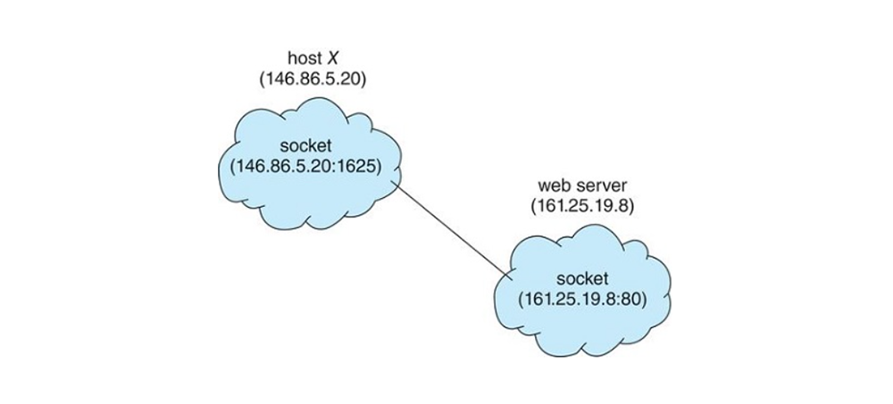

# Module 3: Process Management

## Introduction

This module covers a key function of operating systems: **Process Management**.  
Topics include:

- What a process is
- How processes are synchronized and scheduled
- Process states
- System calls for process creation and termination
- Inter-process communication (IPC) within a system and in client-server environments

---

## Learning Outcomes

By the end of this module, you will be able to:

- ✅ Identify components of a process and how they are represented and scheduled in the OS
- ✅ Describe process creation and termination (including writing programs using system calls)
- ✅ Contrast IPC methods: shared memory vs. message passing
- ✅ Explain client–server communication using sockets and remote procedure calls (RPCs)

---

## Key Terms and Concepts

### 🔹 Process
> A **program in execution**. More than just code—it includes the program counter, registers, variables, and resources.

### 🔹 Thread
> An execution unit within a process.  
- **Single-threaded**: One task at a time  
- **Multithreaded**: Can execute multiple tasks in parallel

### 🔹 Program Counter
> A CPU register pointing to the **next instruction** to be executed in memory.

### 🔹 Process Control Block (PCB)
> A **kernel data structure** storing information about a process, including:
- PID
- CPU registers
- Memory limits
- I/O status

### 🔹 Process Identifier (PID)
> A **unique ID** assigned to each process, used by the OS to track and manage it.

### 🔹 Context Switch
> Switching the CPU from one process (or thread) to another:
- Save the current state
- Load the new state

### 🔹 CPU Scheduler
> The **kernel routine** that selects which ready thread/process should run next and allocates CPU time to it.

---

> 💡 Understanding process management is essential for building systems that are responsive, concurrent, and resource-efficient.

## Process Concepts

### What Is a Process?

A **process** is a **program in execution**. While executing, it needs various resources such as:

- CPU time
- Memory
- Files
- I/O devices

These resources are typically allocated **during execution**.

---

#### Historical Context

- **Early computers**: One program executed at a time, with full control over all resources.
- **Modern systems**: Multiple programs can be **loaded into memory and executed concurrently**.

---

### Key Components of a Process

#### 🔸 Program Counter
A **CPU register** pointing to the **next instruction** in memory to execute.

---

### 🔸 Memory Layout of a Process

+-------------------+
| Stack | ⬅ Grows downward
+-------------------+
| Heap | ⬅ Grows upward
+-------------------+
| Data | ← Global/static variables
+-------------------+
| Text | ← Executable instructions
+-------------------+

- **Text Section**: Executable code
- **Data Section**: Global/static variables
- **Heap**: Dynamically allocated memory during runtime
- **Stack**: Function call info and local variables

> ℹ️ *Heap and stack can grow dynamically. Compiler options can pre-allocate extra space if large usage is expected.*

### Process States

A process moves through several **execution states**:

| State      | Description                                                             |
|------------|-------------------------------------------------------------------------|
| `New`      | The process is being created                                            |
| `Running`  | The process is currently executing instructions                         |
| `Waiting`  | The process is waiting for an event (e.g., I/O completion)              |
| `Ready`    | The process is waiting to be assigned to a processor                    |
| `Terminated` | The process has finished execution                                   |

> 🔹 Only **one process per CPU core** can be in the `Running` state at a time.

---

Transitions depend on events like I/O completion, scheduling, or user/system actions.

---

### Process Control Block (PCB)

Each process is represented by a **Process Control Block**, which contains all necessary metadata, including:

- **Process state** – e.g., Running, Waiting, etc.
- **Program counter** – next instruction address
- **CPU registers** – current values of process-specific registers
- **Scheduling info** – priority, queue pointers
- **Memory info** – memory segments allocated
- **Accounting info** – CPU usage, time limits, elapsed time
- **I/O status** – assigned devices and list of open files

> 🛠 The PCB is **critical** for context switching and process management.

---

## Process Scheduling

### Process Scheduler

- **Multiprogramming Objective:**  
  Keep **some process running at all times** to maximize CPU utilization.

- **Time Sharing Objective:**  
  Switch a CPU core among processes **so frequently** that users can interact with each program while it is running.

- The **process scheduler** selects an available process from the set of ready processes for execution on the CPU.

- On a **single-processor system**, only **one process runs at a time**; others wait until the CPU becomes free.

---

### Scheduling Queues

- **Job Queue:**  
  Contains **all processes** in the system.

- **Ready Queue:**  
  Contains processes that reside in main memory and are **ready and waiting** to execute.

- **Wait Queue:**  
  Contains processes **waiting for events** (e.g., I/O completion).

- **Device Queues:**  
  Manage processes waiting for specific devices.

> **Example:**  
> A process makes an I/O request (e.g., disk read). Since devices are slower than CPUs, the process waits in a **wait queue** until the request completes.

---

### Context Switch

- A **context switch** is the process of switching the CPU from one process to another.

- It involves:
  - **Saving the state (context)** of the currently running process in its **Process Control Block (PCB)**.
  - **Restoring the state** of the next process to run from its PCB.

- When an **interrupt** occurs (e.g., timer interrupt, I/O completion), the system saves the current process's context, suspends it, and resumes another process.

- **Context switch time** is **overhead** — no useful work is done during this switch.

---

### Summary

| Term             | Description                                              |
|------------------|----------------------------------------------------------|
| Process Scheduler| Selects processes for execution on CPU                   |
| Scheduling Queues | Job queue, ready queue, wait queue, device queues        |
| Context Switch   | Saving/restoring process states to switch CPU execution  |

## Operations on Processes

### Process Creation

- Processes can **dynamically create new processes** during execution.
- The process that creates new processes is called the **parent process**.
- The new processes created are called **child processes**.

### Process Identifier (PID)

- Each process is uniquely identified by a **Process Identifier (PID)**.
- The PID is typically an integer number.
- The PID serves as a **unique key** to access process attributes within the kernel.
- Common operating systems like **UNIX, Linux, and Windows** use PIDs.

> Example:  
> In Linux, processes form a **process tree**, where each process shows its name and PID, illustrating parent-child relationships.

---

### Process Termination

- A process **terminates** after executing its last instruction and requests deletion from the OS.
- The OS **deallocates all resources** used by the process, including:
  - Physical and virtual memory
  - Open files
  - I/O buffers

---

## Inter-process Communication (IPC)

### Process Types
- **Independent Processes**:  
  Processes that **do not share data** and cannot affect each other during execution.
  
- **Cooperating Processes**:  
  Processes that **can affect or be affected** by other processes. They often share data or need to coordinate actions.

---

### IPC Models for Cooperating Processes

#### 1. Shared Memory
- Processes **establish a shared memory region** to exchange data directly.
- The shared memory segment usually lives in the address space of the process that created it.
- Other processes **attach** this shared memory to their address space to communicate.
- Normally, the OS prevents one process from accessing another’s memory, but shared memory **requires removing this restriction** by agreement.
- Processes must **coordinate access** to avoid writing conflicts (e.g., using synchronization mechanisms like semaphores or mutexes).

---

#### 2. Message Passing
- Processes communicate by **exchanging messages** rather than sharing memory.
- Suitable for processes that do **not share the same address space** and especially useful in distributed systems.
- Allows processes to **synchronize** and exchange data safely.
- Example: An Internet chat application where participants send messages back and forth.

---

#### Communication Models Diagram

| Shared Memory Model              | Message Passing Model           |
|---------------------------------|--------------------------------|
| Process A <--> Shared Memory <--> Process B | Process A <--> Message <--> Process B |

## Communications in Client-Server Systems

Shared memory and message passing are inter-process communication techniques on a single system. When computers need to communicate in client-server systems, the following techniques can be used:

---

### Sockets

- A **socket** is defined as an endpoint for communication.
- A pair of processes communicating over a network employs a pair of sockets — one for each process.
- A socket is identified by an **IP address** concatenated with a **port number**.
- Sockets generally use a **client–server architecture**:
  - The server **waits** for incoming client requests by listening on a specified port.
  - Once a request is received, the server **accepts a connection** from the client socket to complete the connection.

---

### Remote Procedure Calls (RPC)

- RPC is a common paradigm to abstract the procedure-call mechanism for use between systems connected by a network.
- It is similar to IPC but designed for **processes on separate systems**.
- RPC uses a **message-based communication scheme** to provide remote service.
- Messages exchanged in RPC are **well structured** (not just raw data packets):
  - Each message is addressed to an **RPC daemon** listening on a remote system port.
  - Each message contains:
    - An **identifier** specifying the function to execute.
    - The **parameters** to pass to that function.
- The function executes as requested, and any output is sent back to the requester in a separate message.

---

