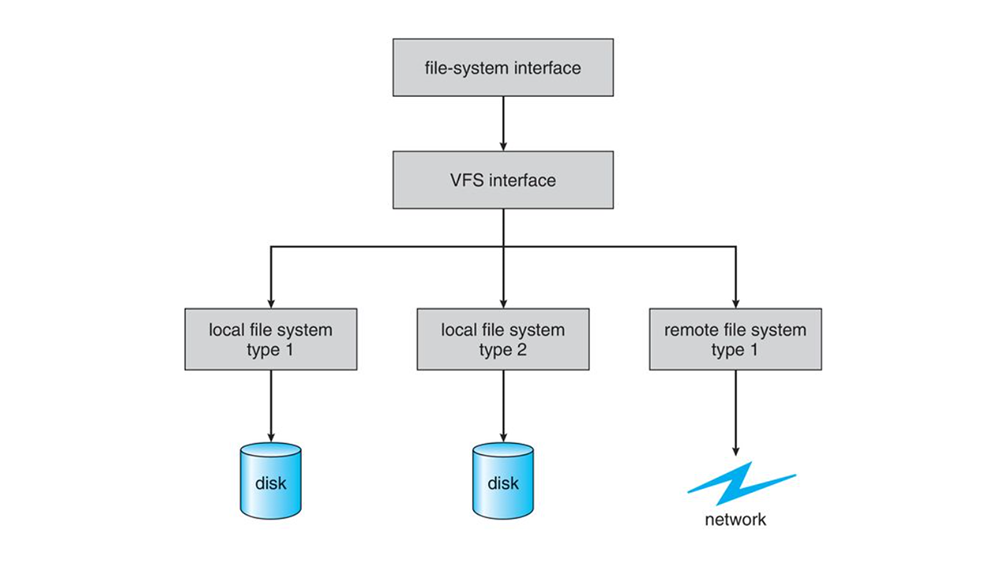

# Module 4: Storage Management – File Systems

## Overview
This module covers concepts relating to the **Storage Management** of a modern Operating System. We will investigate mass storage implementations and the mounting of various devices. Next, we will look at the ways file systems can be structured logically with the use of partitioning and volume management. We will also cover files and directories and learn about how files are allocated on secondary storage and how we can overcome challenges such as fragmentation and performance. This module will span over two weeks.

---

### Learning Outcomes
By the end of this module, you will be able to:

- Explain the function of file systems.
- Describe the interfaces of file systems.
- Discuss access methods, file sharing, protection, and directory structure.
- Describe the details of implementing local file systems and directory structures.
- Delve into the details of file systems and their implementation.
- Explore booting and file sharing.

---

### Key Terms and Concepts

| Term                 | Description                                                                                          |
|----------------------|--------------------------------------------------------------------------------------------------|
| **File System**      | The logical means for the O/S to store and retrieve data on available storage mediums.             |
| **File**             | The smallest logical storage unit; a collection of related information defined by its creator.     |
| **File Extension**   | An identifier specified as a suffix to the name of a computer file. It indicates the file's characteristic or intended use. |
| **Directory**        | An organizational unit or container used to organize folders and files into a hierarchical structure. |
| **Inode**            | Linux stores information about each file and directory in a data structure called an inode. Each inode has a unique inode number. |
| **Access Control List (ACL)** | A list of permissions attached to an object, specifying which users or system processes have access and what operations are allowed. |
| **Partition**        | Logical segregation of storage space into multiple areas, e.g., on HDDs creating groups of contiguous cylinders. |
| **Volume**           | A container of storage; often a device containing a mountable file system or an image of a device's contents. |
| **Mount Point**      | The location within the file structure where a file system is attached.                            |

## File-System Interface

The file system consists of two distinct parts:
- A collection of files, each storing related data
- Directory structure, which organizes and provides information about all of the files in the system.

---

### File Concept
The operating system provides a uniform logical view of stored information. It abstracts from the physical properties of its storage devices to define a logical storage unit, the **File**.

A file is a named collection of related information recorded on secondary storage. It is a sequence of bits, bytes, lines, or records, the meaning of which is defined by the file’s creator and user.

---

### File Attributes

| Attribute              | Description                                                                                      |
|------------------------|------------------------------------------------------------------------------------------------|
| **Name**               | The symbolic file name; only human-readable information stored.                                |
| **Identifier**         | Unique tag (usually a number) identifying the file within the file system; non-human-readable. |
| **Type**               | Indicates file type (needed for systems supporting different file types).                       |
| **Location**           | Pointer to device and location of the file on that device.                                     |
| **Size**               | Current file size (in bytes, words, or blocks) and possibly maximum allowed size.              |
| **Protection**         | Access-control information: who can read, write, execute, etc.                                |
| **Timestamps & User ID** | Data for creation, last modification, last use; useful for security and usage monitoring.     |

---

### File Operations

#### Creating a File
- Find space in the file system.
- Make an entry for the new file in a directory.

#### Opening a File
- Use `open()` system call before other file operations (except create/delete).
- Returns a file handle used for subsequent operations.

#### Writing a File
- Write via system call specifying file handle and data.
- System maintains a **write pointer** for the current write location, updated after each write.

#### Reading a File
- Read via system call specifying file handle and memory location.
- System maintains a **read pointer** for the current read location, updated after each read.
- Typically, read and write operations share a **current-file-position pointer**.

#### Repositioning within a File
- Move the **current-file-position pointer** to a specific location (called **file seek**).
- Does not involve actual I/O.

#### Deleting a File
- Search directory for the file.
- Release all file space and free the directory entry.
- For systems with **hard links**, file contents are deleted only after last link is removed.

#### Truncating a File
- Erase file contents but keep attributes.
- Resets file length to zero and releases file space.

---

### File Locking
- System-wide open-file table keeps track of open files and open counts.
- Multiple processes can open the same file; counts increment/decrement accordingly.
- Operating system ensures write locks to prevent simultaneous write/delete/truncate by multiple processes.

---

### File Types

File types are often indicated by the **file extension** — a suffix to the file name separated by a period (e.g., `resume.docx`).

- The extension helps users recognize file type and the OS associate the file with the proper program.
- Changing the extension does not alter file contents but changes the program association.

**Example:**  
- `.docx` files are associated with Microsoft Word.  
- Rename `.docx` to `.zip` and the OS treats it as a zip archive (because `.docx` is actually a zip file internally). Rename it back to `.docx` to restore Word association.

---

#### Common File Types

| File Type      | Usual Extension(s)           | Function                                        |
|----------------|------------------------------|------------------------------------------------|
| Executable     | `exe`, `com`, `bin`, or none | Ready-to-run machine language program          |
| Object         | `obj`, `o`                   | Compiled machine code, not linked               |
| Source Code    | `c`, `cc`, `java`, `perl`, `asm` | Source code in various languages              |
| Batch          | `bat`, `sh`                  | Commands for command interpreter                |
| Markup         | `xml`, `html`, `tex`         | Textual data, documents                          |
| Word Processor | `xml`, `rtf`, `docx`         | Various word-processor formats                   |
| Library        | `lib`, `a`, `so`, `dll`      | Libraries of routines for programmers           |
| Print or View  | `gif`, `pdf`, `jpg`          | ASCII or binary file for printing or viewing    |
| Archive        | `rar`, `zip`, `tar`          | Grouped files, sometimes compressed, for storage |
| Multimedia     | `mpeg`, `mov`, `mp3`, `mp4`, `avi` | Binary files containing audio or audio/video   |

## Access Methods

When accessing files, the method must be specified in the system call. Common access methods include:

### 1. Sequential Access
- The simplest and most common method.
- Data is accessed in order, from beginning to end.
- Reading (`read_next()`) reads the next portion and advances the file pointer automatically.
- Writing (`write_next()`) appends data at the end and advances the file pointer.
- The file pointer can be reset to the beginning.
- Some systems allow skipping forward or backward by *n* records.
  

---

### 2. Direct Access (Relative Access)
- Allows access to fixed-length logical records in any order.
- The file is viewed as a numbered sequence of blocks or records.
- Can read/write blocks in any order (e.g., read block 14, then block 53, then write block 7).
- No restrictions on access order.
- Ideal for databases and large information retrieval where immediate access to particular blocks is needed.

---

### 3. Other Access Methods (Indexed Access)
- Built on top of direct access using an **index**.
- The index contains pointers to data blocks.
- To find a record, the system first searches the index, then accesses the file directly.
- For very large files, a multi-level index may be used:
  - A primary index pointing to secondary index files.
  - Secondary index files pointing to actual data blocks.

## Directory Structure

The directory acts as a **symbol table** that maps file names to their file control blocks. Directory structures can be organized in various ways.

### Operations on Directory Structures

- **Searching for a file**  
  Ability to find the entry for a specific file by name. May include pattern matching to find all files with similar names.

- **Creating a file**  
  Adding a new file entry to the directory.

- **Deleting a file**  
  Removing a file from the directory. Deletion may leave gaps (“holes”) in the directory, which could require defragmentation.

- **Listing a directory**  
  Listing all files in a directory along with their directory entry details. For large directories (e.g., 600 files), grouping into subdirectories may improve usability.

- **Renaming a file**  
  Changing a file’s name to reflect changes in its contents or use. Renaming might also change the file’s location within the directory structure.

- **Traversing the file system**  
  Accessing every directory and file within the directory hierarchy.

---

### Important Linux Directories

| Directory | Purpose                                                  |
| --------- | -------------------------------------------------------- |
| `/etc`    | System configuration files                                |
| `/var`    | Administrative files like log files                       |
| `/mnt`    | Default directory for mounting non-permanent devices     |
| `/home`   | User personal directories and files                       |
| `/lib`    | Libraries needed to run executables in `/bin` and `/sbin`|
| `/proc`   | Interface between the filesystem and running processes    |

## Protection

When storing information in a computer system, two main concerns arise:

- **Reliability:** Protecting files from physical damage.
- **Protection:** Controlling improper access to files.

---

### Reliability

- Operating systems help protect files from hardware damage by:
  - Marking bad disk sectors to avoid writing files there.
  - Using commands like **Trim** to extend the lifespan of solid-state drives (SSDs).  
    More about Trim: [Wikipedia - Trim (computing)](https://en.wikipedia.org/wiki/Trim_(computing))
  - Providing automatic backup utilities for file restoration after hardware failure.

---

### Protection

Protection mechanisms control access by limiting types of file operations based on permissions.

#### Types of Controlled Operations

- **Read:** Reading file contents.
- **Write:** Writing or rewriting the file.
- **Execute:** Loading and running the file.
- **Append:** Adding new data at the file’s end.
- **Delete:** Removing the file and freeing its space.
- **List:** Listing the file name and attributes.
- **Attribute Change:** Modifying file attributes.

---

### Access Control

- Access is typically dependent on **user identity**.
- Each file/directory has an **Access-Control List (ACL)** listing users and their permitted access types.
- When a user requests access, the OS checks the ACL:
  - If allowed, access is granted.
  - Otherwise, access is denied (protection violation).

#### Common User Classifications

To simplify ACLs, users are grouped as:

- **Owner:** User who created the file.
- **Group:** Users sharing similar access needs.
- **Other:** All remaining users.

Most systems combine ACLs with this owner-group-other scheme for easier management.

---

# Allocation Methods

The direct-access capability of secondary storage allows flexibility in how files are stored on a device. Since many files share the same device, efficient space allocation is critical for performance and utilization.

There are **three major methods** for allocating secondary storage space:

---

## Contiguous Allocation

- Each file occupies a set of **contiguous blocks** on the storage device.
- Defined by the address of the **first block** and the **length** (number of blocks).
- Easy to implement but has limitations, such as external fragmentation and difficulty growing files.
- **Not commonly used in modern file systems**.

---

## Linked Allocation

- Files are stored as a **linked list of blocks**, which can be scattered anywhere on the device.
- The directory contains pointers to the **first and last blocks** of the file.
- Solves problems of contiguous allocation such as fragmentation.
- A notable variation is the **File Allocation Table (FAT)** method used in MS-DOS:
  - A table at the start of the volume contains one entry per block.
  - Each entry points to the next block in the file or an end-of-file marker.
  - Unused blocks have a value of 0.
  - Allocating a new block involves updating the FAT entries accordingly.

  

---

## Indexed Allocation

- Addresses the lack of efficient direct access in linked allocation.
- All pointers to file blocks are kept together in an **index block**.
- When a block is written, its address is stored in the corresponding position in the index block.
- Supports **direct access** without external fragmentation.
- However, it can waste space due to the overhead of the index block, especially for small files.

## Storage Device Management

The operating system manages several important aspects of storage devices, including drive initialization, booting, and bad-block recovery.

---

### Drive Formatting, Partitions, and Volumes

A new storage device starts as a blank slate—a magnetic platter or uninitialized semiconductor cells. Before data can be stored, it must be divided into sectors that the controller can read and write.

- **Low-level formatting**:  
  Fills the device with a special data structure for each sector or page, usually consisting of:  
  - Header (e.g., sector/page number)  
  - Data area  
  - Trailer (e.g., error detection/correction code)

Before using a drive for file storage, the OS must create its own structures in three steps:

1. **Partitioning**  
   Divides the device into one or more groups of blocks or pages. Each partition is treated like a separate device by the OS.

2. **Volume creation**  
   Sometimes implicit (file system placed directly on a partition) or explicit (e.g., multiple partitions combined as RAID). The volume is prepared to be mounted and used.

3. **Logical formatting**  
   Creation of the file system itself. The OS writes initial data structures such as free/allocated space maps and an initial empty directory.

---

### Boot Block

- When a computer starts (power up or reboot), it needs an initial program to run — the **bootstrap loader**.
- Usually stored in non-volatile memory (NVM) flash firmware on the motherboard at a known memory location.
- This small loader then loads the full bootstrap program from **boot blocks** located at a fixed location on the storage device.
- The **boot partition** or **boot disk** contains this program.
- The default Linux bootstrap loader is **GRUB2**.  
  More info: [GRUB2 Manual](https://www.gnu.org/software/grub/manual/grub/grub.html#Overview)

## File Systems

A general-purpose computer system can have multiple storage devices. These devices can be divided into:

- **Partitions**, which hold  
- **Volumes**, which in turn hold  
- **File systems**.

Depending on the volume manager, a volume may span multiple partitions.

---

### File Systems on a Solaris System (Example)

| Mount Point           | File System Type |
|----------------------|------------------|
| /                    | ufs              |
| /devices             | devfs            |
| /dev                 | dev              |
| /system/contract     | ctfs             |
| /proc                | proc             |
| /etc/mnttab          | mntfs            |
| /etc/svc/volatile    | tmpfs            |
| /system/object       | objfs            |
| /lib/libc.so.1       | lofs             |
| /dev/fd              | fd               |
| /var                 | ufs              |
| /tmp                 | tmpfs            |
| /var/run             | tmpfs            |
| /opt                 | ufs              |
| /zpbge               | zfs              |
| /zpbge/backup        | zfs              |
| /export/home         | zfs              |
| /var/mail            | zfs              |
| /var/spool/mqueue    | zfs              |
| /zpbg                | zfs              |
| /zpbg/zones          | zfs              |

> *Note:* The right-hand values show examples of general-purpose and special-purpose file systems.

---

### Common Linux File Systems

| File System | Description                                |
|-------------|--------------------------------------------|
| ext2        | Earlier Linux Filesystem Standard (FSSTND)|
| ext         | Predecessor of ext2 (compatibility)        |
| ext3        | Linux Journalling Filesystem (recent)      |
| ext4        | Successor to ext3, no major new features   |
| nfs         | Network FileSystem (files over network)    |
| msdos       | MS-DOS/Windows FAT/FAT16 filesystem         |
| vfat        | MS FAT32 (Windows 9x) filesystem            |
| ntfs        | Windows NT/2000/XP NTFS filesystem          |

## File-System Mounting

Just as a file must be **opened** before it can be used, a **file system must be mounted** before it becomes available to processes on the system. 

More specifically, a directory structure may be built from multiple file-system-containing volumes, which must be mounted to make them accessible within the file-system namespace.

---

### The Mount Procedure

1. **Input:** The OS is given:
   - The **name of the device**.
   - The **mount point** — the location within the file structure where the file system will be attached.

2. Some operating systems require a **file-system type** to be provided. Others automatically detect the file system type by inspecting the device structures.

3. A **mount point** is typically an **empty directory**.  
   - Example: On a UNIX system, a file system containing user home directories might be mounted at `/home`.  
   - Accessing `/home/jane` refers to the directory `jane` within that mounted file system.
   - Mounting the same file system at `/users` would let you access the same directory as `/users/jane`.

4. The OS then **verifies** that the device contains a valid file system by:
   - Asking the device driver to read the device directory.
   - Checking the directory format against the expected file system format.

5. Finally, the OS records that the file system is mounted at the mount point, enabling traversal across file systems — even of different types — seamlessly.

---

### Example Diagrams

- **Unmounded volume:**

- **Volume mounted at `/users`:**

## Partitions and Mounting

- A **disk** can be divided into multiple **partitions**, or a **volume** can span multiple partitions across multiple disks.

- If a partition contains a **bootable file system** (i.e., an OS is properly installed and configured), it requires **boot information**.

---

### Boot Information

- Boot information has a unique format because **at boot time**, the system does **not** have the file-system code loaded and **cannot interpret** the file-system format.

- Instead, boot information is typically a **sequential series of blocks** loaded into memory as an **image**.

- Execution begins at a predefined location in memory (e.g., the first byte of the image).

- This image is called the **bootstrap loader**, which understands enough about the file system structure to:
  - Find the kernel.
  - Load the kernel into memory.
  - Start kernel execution.

- The boot loader may contain additional instructions, for example:
  - Support for **dual-booting**, allowing multiple operating systems on the same system.

---

### Mounting at Boot Time

- The **root partition**, selected by the boot loader, contains:
  - The operating system kernel.
  - Sometimes other system files.

- This root partition is **mounted at boot time**.

- Other volumes can be:
  - Automatically mounted during boot.
  - Manually mounted later, depending on the OS.

- During mounting, the OS:
  1. Verifies that the device contains a **valid file system**.
     - It asks the device driver to read the device directory.
     - It checks that the directory format matches the expected format.
  2. If the format is invalid, the partition requires **consistency checking and repair**, with or without user intervention.
  3. Finally, the OS records in its **in-memory mount table**:
     - That the file system is mounted.
     - The type of the file system.

- The exact behavior depends on the operating system implementation.

## File Sharing in Multiuser Operating Systems

User-oriented operating systems must support file sharing while ensuring proper protection. This requires maintaining more file and directory attributes than in single-user systems.

---

### Key Concepts

- **Owner (User):**  
  - The user who owns the file or directory.  
  - Has the most control, including changing attributes and granting access permissions.

- **Group:**  
  - A subset of users grouped together for sharing access.  
  - Group members can have a different set of access permissions compared to the owner and others.

---

### Permissions Model (Example: UNIX)

- The **owner** can perform all permitted operations on the file.
- **Group members** can perform a subset of these operations, as defined by the owner.
- **Other users** (everyone else) have their own subset of allowed operations.
- Permissions can be **read**, **write**, **execute**, or none, and are configurable separately for:
  - Owner
  - Group
  - Others

---

### Implementation Details

- Each file or directory stores:
  - Owner ID (user ID)
  - Group ID
  - Permission bits or access control information

- When a user requests an operation on a file:
  1. The system compares the user's ID to the file's owner ID.
  2. The system compares the user's group IDs with the file's group ID.
  3. Based on the match, the applicable permissions are selected.
  4. The system allows or denies the requested operation accordingly.

---

This user/group model allows flexible and secure file sharing in multiuser systems.

## Virtual File Systems (VFS)

Modern operating systems use a **Virtual File System (VFS)** to provide a consistent and transparent interface for interacting with multiple types of file systems (e.g., ext4, FAT32, NFS, ZFS).

---

### Purpose of VFS

The VFS layer enables:
1. **Abstraction** of file system operations, so programs use the same `open()`, `read()`, `write()`, `close()` functions regardless of the underlying file system.
2. **Seamless integration** of different file systems (local or networked).
3. **Unified file identification** using **vnodes** (virtual nodes), which are unique across a network—unlike traditional UNIX `inodes` that are only unique per file system.

---

### VFS Architecture: Three Layers

1. **File-System Interface**  
   - Standard POSIX-like system calls: `open()`, `read()`, `write()`, `close()`.
   - Applications interact only with this layer.

2. **VFS Layer**  
   - Defines a **generic interface** between system calls and specific file system implementations.
   - Handles logic common to all file systems.
   - Maintains **vnodes** for uniquely identifying files across the system or network.

3. **File-System Implementation**  
   - The actual code for managing different file system types like `ext4`, `NTFS`, `ZFS`, etc.
   - Each file system registers with the VFS.

---

### Key Data Structures in Linux VFS

| Object Type   | Description                                      |
|---------------|--------------------------------------------------|
| `inode`       | Represents an individual file (metadata, not name) |
| `file`        | Represents an open file (file descriptor abstraction) |
| `superblock`  | Represents an entire file system (e.g., a mounted volume) |
| `dentry`      | Represents a directory entry (name-to-inode mapping) |

---

### How VFS Helps

✅ Consistent file access across file systems  
✅ Enables network file systems (e.g., NFS)  
✅ Supports file system modules to be loaded/unloaded dynamically  
✅ Improves portability and maintainability of OS code

---

### Summary

VFS acts as a **translator** and **manager** that hides the complexity of specific file system implementations, providing a unified interface to the rest of the OS and applications.
