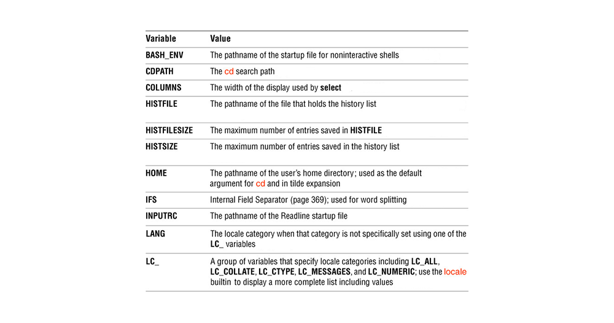
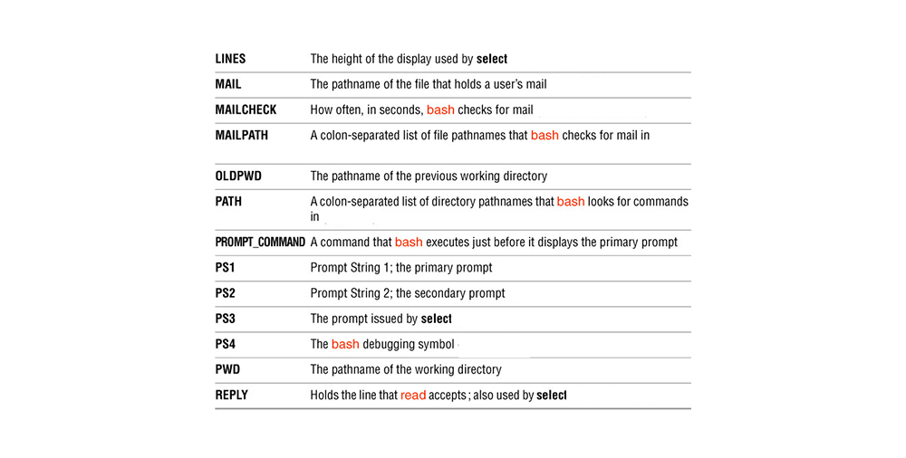
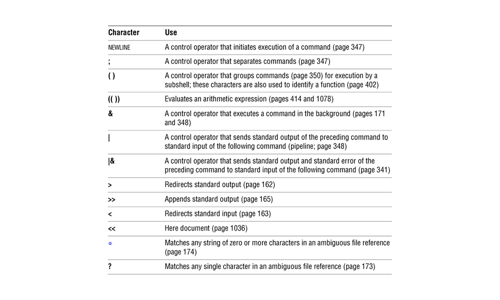

# Module 6: Linux Shell Scripting – Introduction to BASH

## Overview  
This module is an introduction to BASH scripting in Linux. We will begin with an overview of command-line interpreters and then move into exploring BASH implementation variables, comments, positional parameters, and decision structures. We will also investigate granting execute permissions to our scripts and enabling our scripts to be accessible from any working folder by updating our `PATH` variable.

---

### Learning Outcomes  
By the end of this module, you will be able to:

- Explain the basic concepts of command-line interpreters.  
- Identify the Bourne Again Shell (BASH).  
- Implement the creation and referencing of variables as inputs, outputs, parts of arithmetic expressions, and script parameters in BASH scripts.  
- Explain how comments are handled in BASH scripts.  
- Implement file permissions to enable the execution of scripts.  
- Implement decision structures and multi-level decision structures to control the sequence of commands in BASH scripts.

---

### Key Terms and Concepts  

- **Command-line interpreter**  
  A program that allows the entering of commands and then executes those commands to the operating system.

- **Shell script**  
  A file containing a series of commands. The shell reads this file and carries out the commands as though they have been entered directly on the command line.

- **Variable**  
  A symbolic name for a chunk of memory to which we can assign values, read, and manipulate its contents.

- **Positional Parameter**  
  A variable within a shell program whose value is set from an argument specified on the command line that invokes the program. Positional parameters are numbered and referred to with a preceding `$`: `$1`, `$2`, `$3`, and so on.

- **Condition**  
  Conditional statements, expressions, and constructs are features of a programming language that perform different computations or actions depending on whether a boolean condition evaluates to true or false.

## Command-line interpreters

In previous modules, we have explored accessing operating system services by executing commands in a shell. For example, we listed directories, copied files, viewed the process table, etc.

It is named **shell** because it is the outermost layer around the operating system kernel.

Almost all operating systems have one or more command-line interpreters that execute shell scripts line-by-line. The interpreters follow syntax that can vary from one interpreter to the other.

### Examples of Command-line interpreters:

**Unix-like systems:**

- Bourne shell (`sh`)  
- Korn shell (`ksh`)  
- C shell (`csh`)  
- Bourne Again Shell (`bash`)  

**Windows systems:**

- CMD.EXE  
- Windows PowerShell  

This course will cover the industry-leading command interpreter: **Bourne Again Shell (BASH)**

---

### Shell Scripting

A shell script is a file that contains commands that the shell can execute. Shell scripts combine programming logic with operating system commands and help you to automate your tasks.

While shell scripts execute commands sequentially, you can alter the sequential order with decisions, loops, and functions. The control commands will be explored heavily in upcoming modules.

# Bourne Again Shell (BASH) - Summary

- **BASH** is a command interpreter and high-level programming language.
- It processes commands entered interactively or stored in shell script files.
- Supports variables, control flow commands (e.g., loops, if statements).
- Based on the original Bourne Shell by Steve Bourne at Bell Labs.
- Default shell in many Linux distributions like Ubuntu.

## Using Different Shells

- You can switch shells temporarily by typing the shell name (e.g., `bash`, `tcsh`) and pressing **RETURN**.
- Use `exit` to return to the previous shell.
- Nested shells require multiple `exit` commands to return to the original shell.

## Changing Your Login Shell Permanently

- Use the `chsh` command:
  
      chsh

- You will be prompted for your password and the absolute path of the new shell (e.g., `/bin/bash`, `/bin/tcsh`).

## Writing and Executing a Shell Script

- When you create a shell script file, it typically **does not have execute permission** by default.

- Example: Creating a script with `cat` (use **CTRL-D** to end input):

      cat > whoson.sh
      #!/bin/bash
      who

- Initially, trying to run the script may result in a **permission denied** error because the execute bit is not set.

### Granting Execute Permission

- Use `chmod` to add execute permission:

      ls -l whoson.sh       # View current permissions
      chmod +x whoson.sh    # Add execute permission
      ls -l whoson.sh       # Confirm permissions updated

- Now you can run the script without errors:

      ./whoson.sh

### Tip

- Save scripts in a dedicated `scripts` directory.
- Add this directory to your `PATH` environment variable to run scripts from any location:

      export PATH=$PATH:/path/to/scripts

## Comments in Code

- Comments help users understand the program.
- Use the `#` symbol to start a comment.
- The shell ignores everything after `#` on the same line.
- Exception: If the first line starts with `#!`, it specifies the interpreter (shebang).

### Comments Example

    # This is a comment
    echo "Hello, world!"   # This prints a message

    #!/bin/bash
    # This script prints the current date
    date

## Variables

### User-created variables

- Declare and initialize a variable:
  
      VARIABLE=value

- No spaces around the `=`.
- Retrieve value by prefixing with `$`:

      echo $VARIABLE

- To remove a variable:
  - Set it to empty: `person=`
  - Or unset it: `unset person`

### Arithmetic expressions

- BASH handles only integers.
- Two forms of arithmetic expressions:

      (( variable = value1 operator value2 ))
      (( value1 operator value2 ))

- Supported operators:
  - `variable++` (increment)
  - `variable--` (decrement)
  - `**` (exponentiation)
  - `*` (multiply)
  - `/` (division)
  - `%` (modulus)
  - `+` (addition)
  - `-` (subtraction)

- Parentheses `(( ))` are needed for arithmetic evaluation.

### Keyword variables

- Special variables with predefined meanings.
- Examples include:
  - `HOME` — user's home directory
  - `PATH` — directories searched for commands
- Some are inherited from the environment at shell startup.
- Others are created and initialized by the shell.

Below is a list of keyword variables and descriptions that can be used in the linux command-line and within shell scripts:

## Special Characters
The following table lists characters that are special to the bash shell. This is a great cheat sheet to have for any linux administrator.

## Positional Parameters

- BASH scripts receive parameters accessible via numbered variables:
  - `$0` — the script name
  - `$1` to `$9` — the first to ninth parameters passed to the script

- Example: a script expecting 4 parameters uses `$1`, `$2`, `$3`, `$4` to access the values.

- Good practice: validate the parameters before using them.

- When more than 9 parameters are needed, the `shift` command can be used to shift the positional parameters to the left, allowing access to parameters beyond `$9`.

### Example usage:

    #!/bin/bash
    echo "Parameter 1: $1"
    echo "Parameter 2: $2"
    echo "Parameter 3: $3"
    echo "Parameter 4: $4"

## Decision Structures

In Linux shell scripting, `if` statements provide decision-making capabilities.

### Basic syntax:

    if condition
    then
      Statement1
      Statement2
      ...
    fi

- If the condition is true, the statements after `then` execute.
- If false, the statements are skipped.

### If-else structure:

    if condition
    then
      Statement1
      Statement2
      ...
    else
      StatementA
      StatementB
      ...
    fi

- Executes `else` block if condition is false.

### Conditional expressions:

#### Numerical comparison operators:

- `-lt`  : less than  
- `-le`  : less than or equal  
- `-gt`  : greater than  
- `-ge`  : greater than or equal  
- `-eq`  : equal to  
- `-ne`  : not equal to  

#### String comparison operators:

- `string1 = string2`    : equal strings  
- `string1 != string2`   : strings not equal  
- `-n string1`           : string length is not zero  
- `-z string1`           : string length is zero  

#### File/directory test operators:

- `-s file` : file is not empty  
- `-f file` : file is a regular file (not a directory)  
- `-e file` : file exists  
- `-d dir`  : directory exists  
- `-w file` : file is writable  
- `-r file` : file is readable  
- `-x file` : file is executable  

#### Logical operators:

- `&&` : AND  
- `||` : OR  
- `!`  : NOT  

### Multi-level if-then-else (elif):

    if condition
    then
      # commands if condition true
    elif condition1
    then
      # commands if condition1 true
    elif condition2
    then
      # commands if condition2 true
    else
      # commands if none of the above conditions true
    fi

### Getting user input

Use the `read` command to prompt for input:

    echo "Enter your name: "
    read myname

#### `read` options:

- `-p prompt` : display prompt message  
- `-s`        : silent mode (no echo)  
- `-t seconds`: timeout for input  

If no variable specified, input is stored in `$REPLY`.

Example:

    read -p "Enter your name: "
    echo "Hello, $REPLY"
