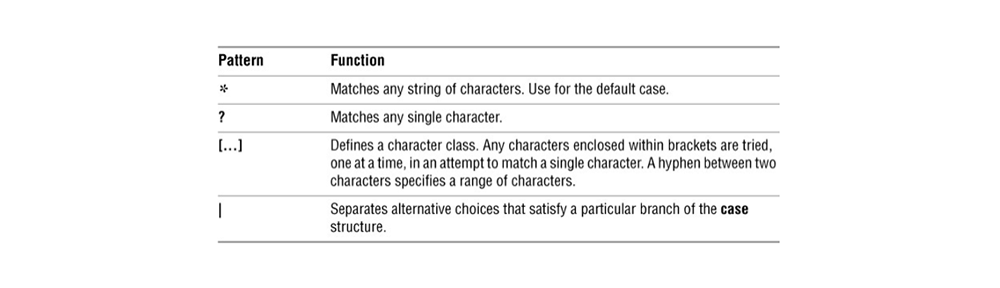

# Module 7: Linux Shell Scripting – Selection and Iteration

## Introduction

This module expands on BASH control structures with:
- `case` statements
- Looping constructs (`for`, `while`, `until`)
- Loop control (`break`, `continue`)
- Directory tree searches
- Midterm 2 covers Modules 1–7

---

## Learning Outcomes

By the end of this module, you will be able to:

- Implement `case` statements in BASH
- Use `for`, `while`, and `until` loops
- Use `break` to exit loops early
- Use `continue` to skip to the next iteration
- Search files recursively through a directory tree

---

## Key Terms and Concepts

- **Pattern**  
  A logical structure used for matching values in a `case` statement.

- **Condition**  
  An expression evaluated as true or false.

- **Iteration**  
  Repeating a set of instructions multiple times until a condition is met.

- **Loop**  
  A structure that repeats commands while a condition remains true.

## Case Structure

The `case` statement is a multi-branch decision structure used to compare a test string against multiple patterns.

### Syntax

    case test-string in
        pattern-1)
            commands-1
            ;;
        pattern-2)
            commands-2
            ;;
        pattern-3)
            commands-3
            ;;
        ...
        *)
            default-commands
            ;;
    esac

- Each pattern block ends with `;;`
- The `*` pattern acts like a default (catch-all)
- The block ends with `esac`

### Example

    read -p "Enter A, B, or C: " letter

    case "$letter" in
        A)
            echo "You entered A"
            ;;
        B)
            echo "You entered B"
            ;;
        C)
            echo "You entered C"
            ;;
        *)
            echo "You did not enter A, B, or C"
            ;;
    esac
    $ ./casel
    Enter A, B, or C: B
    You entered B

### Notes

- Patterns can include wildcards (globs), like `*`, `?`, `[ ]`
- Useful for simplifying multiple `if-elif` statements

## Loops in BASH
A loop repeats a set of statements until a condition terminates it. Each repetition is called an iteration.

Loops may have a fixed or indefinite number of iterations. Infinite loops can occur due to poor logic and must be stopped manually (e.g., with the kill command).

Loop Types in BASH
1. while Loop
- Executes the block while the condition is true.
- Condition checked before each iteration.

    while condition
    do
        statement1
        statement2
        ...
    done

Example:

    count=1
    while [ $count -le 5 ]
    do
        echo "Count is $count"
        ((count++))
    done

2. until Loop
- Executes the block until the condition becomes true.
- Opposite of while: runs while condition is false.

    until condition
    do
        statement1
        statement2
        ...
    done

Example:

    count=1
    until [ $count -gt 5 ]
    do
        echo "Count is $count"
        ((count++))
    done

3. for Loop
There are two forms:

Word list form
- Loops through a list of words or items.

    for variable in list
    do
        statement1
        statement2
        ...
    done

Example:

    for fruit in apple banana cherry
    do
        echo "I like $fruit"
    done

Arithmetic expression form
- Uses C-style syntax with initialization, condition, and increment.
  
    for (( initialization; condition; increment ))
    do
        statement1
        statement2
        ...
    done

Example:

    for (( i=1; i<=5; i++ ))
    do
        echo "Number $i"
    done

## Break and Continue in Bash Loops

### break

- The `break` statement immediately exits the **innermost** loop.
- It is used to stop the loop early based on a condition.

Example:

    count=1
    while [ $count -le 10 ]
    do
        if [ $count -eq 5 ]; then
            echo "Breaking at count $count"
            break
        fi
        echo "Count is $count"
        ((count++))
    done

Output:

    Count is 1
    Count is 2
    Count is 3
    Count is 4
    Breaking at count 5

---

### continue

- The `continue` statement skips the rest of the current loop iteration and moves to the next iteration.
- It is useful for skipping specific iterations based on a condition.

Example:

    for i in {1..5}
    do
        if [ $i -eq 3 ]; then
            echo "Skipping $i"
            continue
        fi
        echo "Processing $i"
    done

Output:

    Processing 1
    Processing 2
    Skipping 3
    Processing 4
    Processing 5

## Searching for Files with `find`

The `find` command searches for files in the filesystem. It locates files within directory trees based on specified criteria.

### General syntax:

    find path expression

- If `path` is not specified, the current directory (`.`) is used by default.
- `expression` consists of options, tests, and actions that filter or specify what to find.

---

### Common examples:

Search files modified more than 90 days ago:

    find -mtime +90

- `-mtime +90`: Files modified **more than** 90 days ago.
- `-mtime -90`: Files modified **less than** 90 days ago.
- `-mtime 90`: Files modified **exactly** 90 days ago.

---

Find files larger than 10 kilobytes in current directory:

    find . -size +10k

- `-size +10k`: Files **greater than** 10 kilobytes.
- Similarly, use `-size -10k` for smaller than 10k, or `-size 10k` for exactly 10k.

---

Find all mp3 files anywhere starting from root `/`:

    find / -name "*.mp3"

- `-name "*.mp3"`: Matches files ending with `.mp3`.

---

Find all directories in the current location:

    find -type d

- `-type d`: Finds directories only.

---

Find all files owned by user "andrew" (ignore permission errors):

    find / -user andrew 2> /dev/null

- `-user andrew`: Files owned by the user `andrew`.
- `2> /dev/null`: Redirects error messages (e.g., permission denied) to null, so they are not shown.

